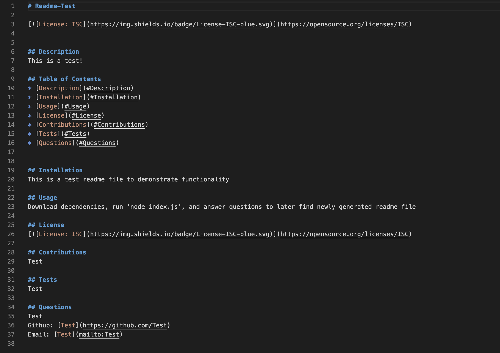

 # README File Generator

## Table of Contents

* [Introduction](#introduction)
* [Features](#features)
* [Installation](#installation)
* [Technologies Used](#technologies-used)
* [Usage](#usage)
* [Screenshots](#screenshots)
* [Future Developments](#future-developments)
* [Contact](#contact)
* [Contributions](#contributions)
* [License](#license)
* [Demo](#demo)

## Introduction

This is a Readme File generator that produces a professional Readme file based on a user's responses to prompted questions.

## Features

* Prompted questions answered in the user's terminal.
* Generates a Readme file with text information regarding the project's title, description, installation, usage, license, contributions, testing, and contact information.

## Technologies Used

* Node Library 
* Inquirer Package

## Installation
This project can be accessed locally by following these steps:

1. Clone the repository to your local machine.
2. Install the necessary dependencies by running npm install.
3. Start the project by running node index.js in your terminal.

## Usage

Navigate to the terminal

* Begin by installing dependencies.
* Start the project by running 'node index.js'.
* Answer each of the questions based your project's details.
* After the questions have been submitted, indentify the newly generated Readme file with your responses.

## Screenshots 

### Terminal Prompted Questions

### Generated Readme File

## Future Developments

* Further add questions to include future developments, technology used, and demo links or videos.

* Refine the structure of the README outline and questions to enhance its professionalism.

## Contact

If there are any questions or feedback, feel free to reach out via: 

* Github Issues: [Github](http://Github.com/Taylor-Brandon)

* Email: [Email](mailto://taylorbrandon.dev@gmail.com)

## Contributions

Special thanks to Columbia Bootcamps for providing the educational resources necessary to complete this project.

## License

## Demo

